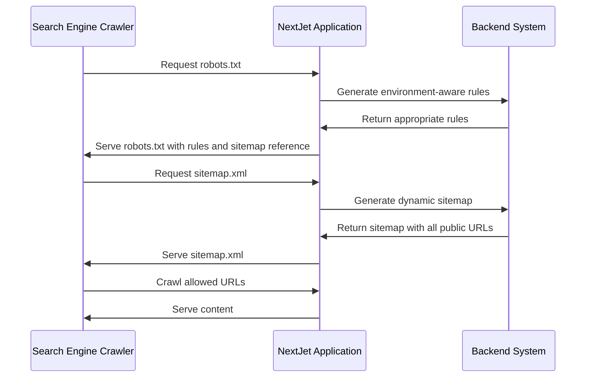
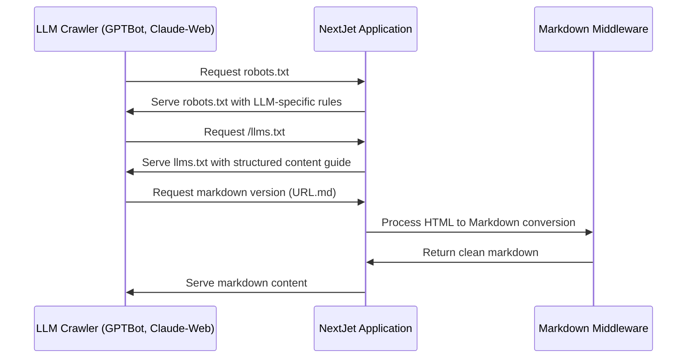
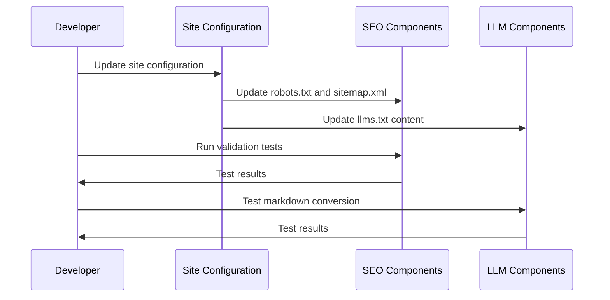
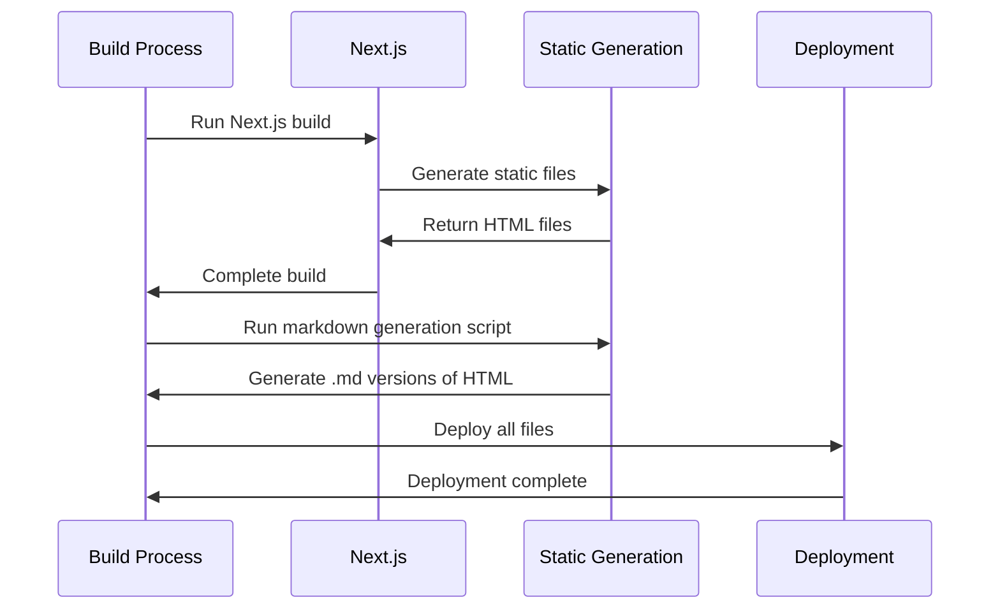
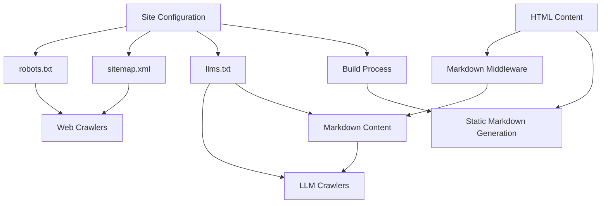

# SEO and LLM Content Strategy Application Flow

## Overview

This document outlines the flow of interactions between users, search engines, LLMs, and the NextJet SaaS platform with the new SEO and LLM Content Strategy components implemented.

## User and System Flows

### 1. Search Engine Crawler Flow



#### Description

1. **Initial Discovery**: Search engine crawler requests `/robots.txt`
   - Application checks environment (production/development)
   - Returns appropriate rules based on environment
   - Includes reference to sitemap location

2. **Sitemap Processing**: Crawler requests `/sitemap.xml`
   - Application dynamically generates sitemap with all public URLs
   - Includes metadata (last modified dates, priorities, etc.)
   - Returns complete sitemap to crawler

3. **Content Crawling**: Crawler follows allowed URLs
   - Respects disallow rules from robots.txt
   - Prioritizes crawling based on sitemap priorities
   - Indexes content according to search engine algorithms

### 2. LLM Crawler Flow



#### Description

1. **Discovery and Permissions**: LLM crawler requests `/robots.txt`
   - Application serves robots.txt with LLM-specific crawling rules
   - Different rules may exist for different LLM crawlers (GPTBot, Claude-Web, etc.)

2. **Content Guidance**: LLM crawler requests `/llms.txt`
   - Application serves llms.txt with structured guide to site content
   - Provides hierarchical organization of key resources
   - Links to markdown versions of important content

3. **Markdown Access**: LLM requests markdown versions of content
   - Middleware intercepts requests ending in `.md`
   - HTML is converted to clean, readable markdown
   - Non-essential elements (navigation, footers) are removed
   - Markdown is served with proper content type headers

### 3. User Flow (Developer Implementation)



#### Description

1. **Configuration**: Developer updates site configuration
   - Modifies environment variables or configuration files
   - Changes automatically propagate to all SEO and LLM components

2. **Validation**: Developer runs validation tests
   - Tests confirm robots.txt has correct rules for all environments
   - Tests verify sitemap includes all public pages with metadata
   - Tests check llms.txt format and content structure

3. **Verification**: Developer verifies all components work together
   - Confirms all cross-references are correct
   - Ensures markdown conversion works properly
   - Checks that environment-specific behavior functions correctly

### 4. Build Process Flow



#### Description

1. **Build Initialization**: Next.js build process starts
   - Generates static HTML files for all pages
   - Creates robots.txt and sitemap.xml files

2. **Markdown Generation**: Post-build script runs
   - Scans output directory for HTML files
   - Converts HTML to markdown for each file
   - Stores markdown alongside HTML files

3. **Deployment**: All files are deployed
   - HTML, markdown, robots.txt, and sitemap.xml are deployed
   - Route handlers for dynamic content (llms.txt) are deployed
   - Middleware for on-demand markdown conversion is deployed

## Component Interaction Diagram



## Technical Flow Details

### 1. Environment Detection Flow

```typescript
// Simplified environment detection flow
function detectEnvironment() {
  if (process.env.NODE_ENV === 'production') {
    return {
      allowCrawlers: true,
      baseUrl: process.env.NEXT_PUBLIC_APP_URL,
      environment: 'production'
    }
  } else {
    return {
      allowCrawlers: false,
      baseUrl: 'http://localhost:3000',
      environment: 'development'
    }
  }
}

// Usage in robots.ts
const env = detectEnvironment()
if (!env.allowCrawlers) {
  // Block all crawlers in non-production
}
```

### 2. Markdown Conversion Flow

```
1. Request for URL.md received
2. Middleware intercepts request
3. Fetch original HTML content
4. Parse HTML document with JSDOM
5. Extract metadata (title, description)
6. Remove non-essential elements
7. Apply Turndown conversion to markdown
8. Add YAML frontmatter
9. Return markdown with text/plain content type
```

### 3. Dynamic Content Flow

```
1. Blog or documentation content updated
2. Next.js detects content changes
3. Sitemap.xml automatically updated with new content
4. llms.txt links updated to include new resources
5. Markdown versions generated during build
```

## Integration Points

### 1. Cross-Component Integration

- **Robots.txt ↔ Sitemap.xml**: Robots.txt references sitemap location
- **LLMs.txt ↔ Markdown Content**: LLMs.txt links to markdown versions of content
- **Sitemap.xml ↔ Content Sources**: Sitemap pulls from the same content sources as the website

### 2. Feature Flag Integration

- **Environment Variables**: Control feature availability in different environments
- **Shared Configuration**: Central configuration ensures consistency across components

### 3. Testing Integration

- **Automated Testing**: Tests verify correct integration between components
- **Environment-Specific Testing**: Tests confirm behavior differences between environments

## Conclusion

This application flow document outlines how search engines, LLMs, users, and developers interact with the SEO and LLM content strategy components. The flow ensures a seamless experience for all stakeholders while maintaining consistency across all components.

The system is designed to be:
- **Environment-aware**: Different behavior in production vs. development
- **Self-consistent**: All components reference each other correctly
- **Automated**: Content updates automatically reflect in all components
- **Maintainable**: Central configuration ensures future changes are easy to implement 