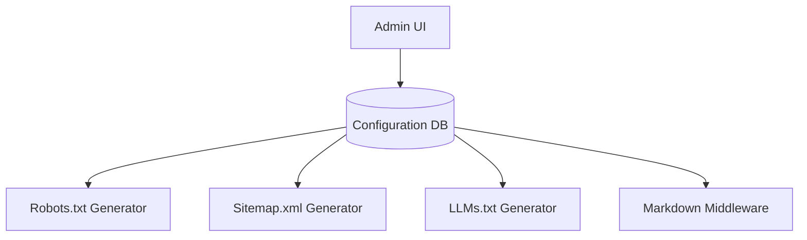
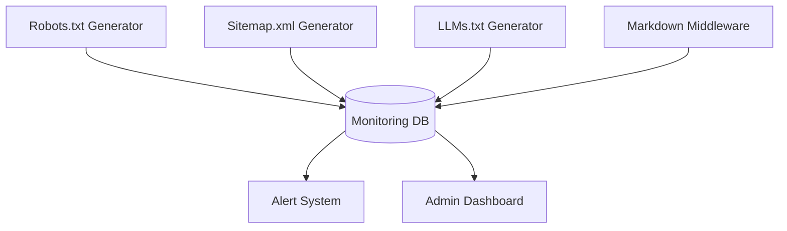
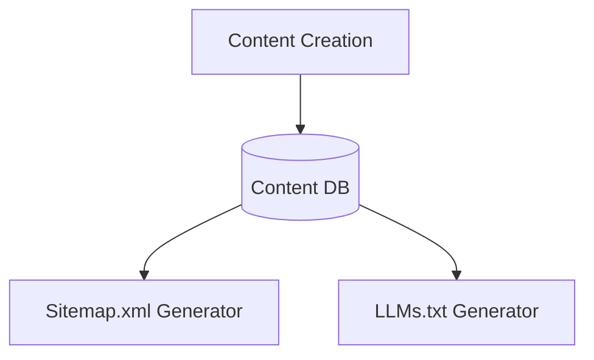
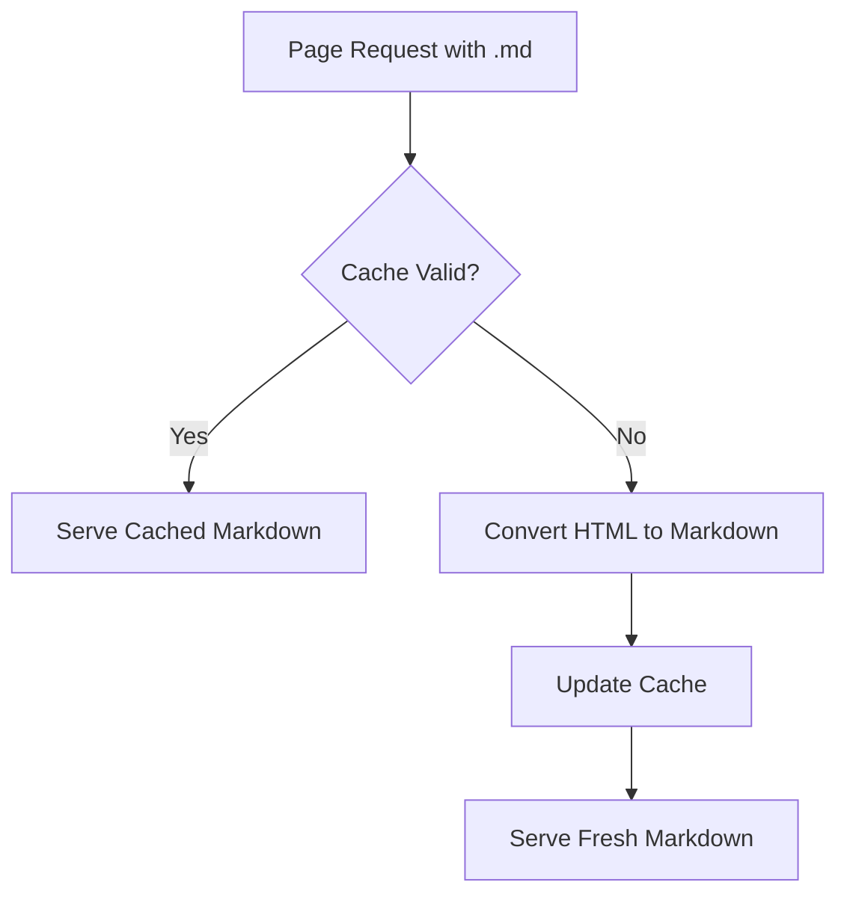

# SEO and LLM Content Strategy Data Schema

## Overview

This document outlines the data schema and storage requirements for the SEO and LLM Content Strategy feature. While most of this feature is implemented through file-based configurations and middleware, there are several data-related considerations to ensure optimal performance, monitoring, and configuration management.

## Data Requirements

The SEO and LLM Content Strategy feature requires the following data storage components:

1. **Configuration Storage**: Site-wide settings for SEO and LLM components
2. **Monitoring Data**: Performance metrics and error logs for SEO components
3. **Cache Storage**: Temporary storage for generated markdown and other dynamic content
4. **Content Metadata**: Enhanced metadata for content used in sitemap and LLMs.txt

## Database Schema

### 1. Configuration Table

The `seo_config` table stores centralized configuration for all SEO and LLM components.

#### Schema

```sql
CREATE TABLE seo_config (
  id VARCHAR(50) PRIMARY KEY,
  value JSON NOT NULL,
  updated_at TIMESTAMP NOT NULL DEFAULT CURRENT_TIMESTAMP,
  updated_by VARCHAR(255)
);
```

#### Sample Data

```json
{
  "id": "robots_txt_settings",
  "value": {
    "allowAll": true,
    "disallowPaths": ["/admin/", "/api/", "/dashboard/", "/auth/"],
    "llmSpecificRules": [
      {
        "userAgent": "GPTBot",
        "allow": ["/blog/", "/docs/", "/faq/"],
        "disallow": ["/admin/", "/api/", "/dashboard/", "/auth/"]
      },
      {
        "userAgent": "Anthropic-AI",
        "allow": ["/blog/", "/docs/", "/faq/"],
        "disallow": ["/admin/", "/api/", "/dashboard/", "/auth/"]
      }
    ]
  },
  "updated_at": "2025-03-15T12:00:00Z",
  "updated_by": "admin@example.com"
}
```

```json
{
  "id": "llms_txt_settings",
  "value": {
    "extendedDescription": "A comprehensive SaaS starter template with built-in authentication, payments, and user management.",
    "sections": [
      {
        "title": "Documentation",
        "links": [
          {
            "title": "Getting Started",
            "url": "/docs/getting-started.md",
            "description": "Introduction to the project"
          },
          {
            "title": "API Reference",
            "url": "/docs/api.md",
            "description": "Detailed API documentation"
          }
        ]
      },
      {
        "title": "Examples",
        "links": [
          {
            "title": "Basic Example",
            "url": "/examples/basic.md",
            "description": "Simple implementation example"
          }
        ]
      }
    ]
  },
  "updated_at": "2025-03-15T12:00:00Z",
  "updated_by": "admin@example.com"
}
```

### 2. Monitoring Table

The `seo_monitoring` table tracks the status and performance of SEO components.

#### Schema

```sql
CREATE TABLE seo_monitoring (
  id SERIAL PRIMARY KEY,
  component VARCHAR(50) NOT NULL,
  status VARCHAR(20) NOT NULL,
  last_generated TIMESTAMP NOT NULL,
  error_message TEXT,
  performance_metrics JSON,
  created_at TIMESTAMP NOT NULL DEFAULT CURRENT_TIMESTAMP
);

CREATE INDEX idx_seo_monitoring_component ON seo_monitoring(component);
CREATE INDEX idx_seo_monitoring_created_at ON seo_monitoring(created_at);
```

#### Sample Data

```json
{
  "id": 1,
  "component": "robots_txt",
  "status": "active",
  "last_generated": "2025-03-15T12:00:00Z",
  "error_message": null,
  "performance_metrics": {
    "generation_time_ms": 15,
    "size_bytes": 512,
    "request_count_24h": 150
  },
  "created_at": "2025-03-15T12:00:00Z"
}
```

```json
{
  "id": 2,
  "component": "sitemap_xml",
  "status": "active",
  "last_generated": "2025-03-15T12:00:00Z",
  "error_message": null,
  "performance_metrics": {
    "generation_time_ms": 230,
    "size_bytes": 15360,
    "url_count": 87,
    "request_count_24h": 42
  },
  "created_at": "2025-03-15T12:00:00Z"
}
```

```json
{
  "id": 3,
  "component": "llms_txt",
  "status": "active",
  "last_generated": "2025-03-15T12:00:00Z",
  "error_message": null,
  "performance_metrics": {
    "generation_time_ms": 25,
    "size_bytes": 1024,
    "request_count_24h": 78
  },
  "created_at": "2025-03-15T12:00:00Z"
}
```

```json
{
  "id": 4,
  "component": "markdown_middleware",
  "status": "active",
  "last_generated": "2025-03-15T12:00:00Z",
  "error_message": null,
  "performance_metrics": {
    "average_conversion_time_ms": 120,
    "request_count_24h": 35,
    "error_count_24h": 2,
    "cache_hit_ratio": 0.85
  },
  "created_at": "2025-03-15T12:00:00Z"
}
```

### 3. Markdown Cache Table

The `markdown_cache` table stores pre-generated markdown versions of HTML content to improve performance.

#### Schema

```sql
CREATE TABLE markdown_cache (
  url_path VARCHAR(255) PRIMARY KEY,
  markdown_content TEXT NOT NULL,
  html_hash VARCHAR(64) NOT NULL,
  created_at TIMESTAMP NOT NULL DEFAULT CURRENT_TIMESTAMP,
  expires_at TIMESTAMP NOT NULL
);

CREATE INDEX idx_markdown_cache_expires_at ON markdown_cache(expires_at);
```

#### Sample Data

```json
{
  "url_path": "/docs/getting-started",
  "markdown_content": "---\ntitle: Getting Started with NextJet\ndescription: \"Learn how to set up your SaaS application with NextJet\"\ndate: 2025-03-15T12:00:00.000Z\n---\n\n# Getting Started with NextJet\n\nThis guide will help you set up your NextJet SaaS application...",
  "html_hash": "a1b2c3d4e5f6...",
  "created_at": "2025-03-15T12:00:00Z",
  "expires_at": "2025-03-16T12:00:00Z"
}
```

### 4. Content Metadata Extension

Extend existing content tables with additional SEO-specific metadata fields.

#### Blog Posts Table Extension

```sql
ALTER TABLE blog_posts
ADD COLUMN seo_priority DECIMAL(3,2) DEFAULT 0.8,
ADD COLUMN seo_change_frequency VARCHAR(20) DEFAULT 'monthly',
ADD COLUMN include_in_llms_txt BOOLEAN DEFAULT true,
ADD COLUMN llms_txt_description VARCHAR(255);
```

#### Documentation Table Extension

```sql
ALTER TABLE documentation
ADD COLUMN seo_priority DECIMAL(3,2) DEFAULT 0.7,
ADD COLUMN seo_change_frequency VARCHAR(20) DEFAULT 'monthly',
ADD COLUMN include_in_llms_txt BOOLEAN DEFAULT true,
ADD COLUMN llms_txt_description VARCHAR(255);
```

## Alternative Data Storage Options

While a relational database is ideal for structured data and monitoring, some implementations may prefer alternative storage options for specific components:

### 1. Environment Variables for Configuration

For simpler deployments, configuration can be stored in environment variables instead of a database:

```bash
# Base configuration
NEXT_PUBLIC_APP_URL=https://example.com
NEXT_PUBLIC_SITE_NAME=NextJet SaaS
NEXT_PUBLIC_SITE_DESCRIPTION=Modern SaaS template for Next.js

# Robots.txt configuration
SEO_ROBOTS_ALLOW_ALL=true
SEO_ROBOTS_DISALLOW_PATHS=/admin/,/api/,/dashboard/,/auth/
SEO_ROBOTS_LLM_ALLOW_PATHS=/blog/,/docs/,/faq/

# LLMs.txt configuration
SEO_LLMS_TXT_EXTENDED_DESCRIPTION=A comprehensive SaaS starter template with built-in authentication, payments, and user management.
```

### 2. JSON Files for Configuration

For file-based deployments, configuration can be stored in JSON files:

```json
// seo-config.json
{
  "robots_txt": {
    "allowAll": true,
    "disallowPaths": ["/admin/", "/api/", "/dashboard/", "/auth/"],
    "llmSpecificRules": [
      {
        "userAgent": "GPTBot",
        "allow": ["/blog/", "/docs/", "/faq/"],
        "disallow": ["/admin/", "/api/", "/dashboard/", "/auth/"]
      }
    ]
  },
  "llms_txt": {
    "extendedDescription": "A comprehensive SaaS starter template with built-in authentication, payments, and user management.",
    "sections": [
      {
        "title": "Documentation",
        "links": [
          {
            "title": "Getting Started",
            "url": "/docs/getting-started.md",
            "description": "Introduction to the project"
          }
        ]
      }
    ]
  }
}
```

### 3. Redis for Caching

For high-performance applications, Redis can be used for markdown caching:

```
# Redis cache format
KEY: markdown:cache:/docs/getting-started
VALUE: {
  "markdown_content": "---\ntitle: Getting Started...",
  "html_hash": "a1b2c3d4e5f6...",
  "created_at": "2025-03-15T12:00:00Z",
  "expires_at": "2025-03-16T12:00:00Z"
}
```

## Data Flow

### 1. Configuration Data Flow



### 2. Monitoring Data Flow



### 3. Content Metadata Flow



### 4. Markdown Cache Flow



## Data Access Patterns

### 1. Configuration Access

The configuration data is typically accessed during:
- Initial application startup
- On-demand generation of SEO components
- Admin UI display and updates

**Access Pattern**: Read-heavy with infrequent updates

### 2. Monitoring Data Access

Monitoring data is accessed during:
- Regular status checks (every 5-15 minutes)
- Dashboard display
- Alert triggering

**Access Pattern**: Write-heavy with aggregated reads

### 3. Markdown Cache Access

The markdown cache is accessed:
- On every request for a markdown version of a page
- During cache invalidation after content updates

**Access Pattern**: High-volume reads and writes with time-based expiration

## Data Migration Considerations

When implementing this feature in an existing application, consider the following data migration steps:

1. **Add Configuration Tables**: Create the new configuration tables without affecting existing data
2. **Populate Initial Configuration**: Generate initial configuration based on existing content and settings
3. **Add Metadata Fields**: Extend content tables with new metadata fields, setting default values
4. **Build Initial Cache**: Pre-generate markdown cache for high-traffic pages

## Backup and Recovery Strategy

### Critical Data Components

The following data components require regular backup:

1. **Configuration Data**: Essential for SEO component generation
2. **Content Metadata**: Important for proper SEO functionality

### Non-Critical Data Components

These components can be regenerated and don't require regular backup:

1. **Monitoring Data**: Historical monitoring data is useful but not critical
2. **Markdown Cache**: Can be regenerated on-demand

### Recommended Backup Schedule

- **Configuration Data**: Daily backup with change-triggered backups
- **Content Metadata**: Included in regular content backup schedule
- **Monitoring Data**: Weekly backup of aggregated data

## Data Security Considerations

### 1. Access Control

- **Configuration Data**: Admin-level access only
- **Monitoring Data**: Admin and developer access
- **Content Metadata**: Content editor access
- **Markdown Cache**: System-level access only

### 2. Sensitive Information

The SEO and LLM content strategy components do not typically store sensitive information, but care should be taken with:

- **Internal URLs**: Ensure internal-only URLs are not exposed in sitemap.xml or LLMs.txt
- **Development Environment Data**: Ensure development data is not exposed in production SEO components

## Conclusion

This data schema provides a comprehensive foundation for implementing the SEO and LLM Content Strategy feature. While the core functionality is primarily file-based and middleware-driven, these data components ensure proper configuration management, performance optimization, and monitoring capabilities. 