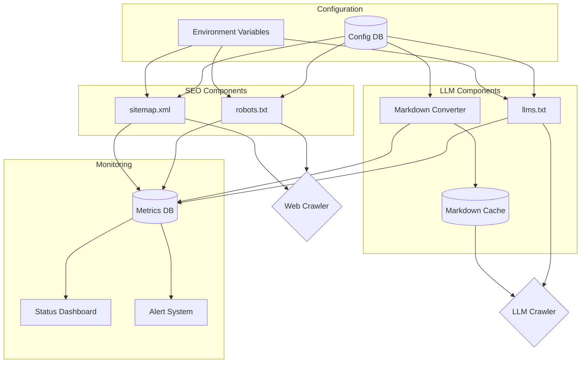

# SEO and LLM Content Strategy Feature Overview

## Executive Summary

The SEO and LLM Content Strategy feature enhances the NextJet SaaS template with comprehensive search engine optimization and large language model (LLM) accessibility capabilities. This implementation creates a unified approach to content discoverability across both traditional search engines and emerging AI assistants.

**Key Components:**
- Standard SEO tools (robots.txt, sitemap.xml) with modern implementation
- Jeremy Howard's LLMs.txt standard for AI assistant content guidance
- Markdown versions of HTML pages for improved LLM content processing
- Integrated monitoring and configuration management

## Feature Benefits

| Stakeholder | Benefits |
|-------------|----------|
| **End Users** | - Improved content discoverability via search engines - More accurate information from AI assistants - Better user experience through targeted content |
| **Developers** | - Centralized configuration management - Automated content updates across SEO components - Modern implementation using Next.js App Router |
| **Content Creators** | - Automatic inclusion of new content in SEO components - Control over content visibility to different crawlers - Enhanced metadata management |
| **Business** | - Increased organic traffic from search engines - Better representation in AI assistant responses - Improved content accessibility |

## Feature Components

### 1. Robots.txt Implementation

**Purpose:** Control web crawler access to different parts of the site.

**Key Capabilities:**
- Environment-aware rules (production vs. development)
- Specific rules for LLM crawlers (GPTBot, Claude-Web, etc.)
- Sitemap reference
- Comprehensive controls for different user agents

**Implementation Method:**
- Next.js App Router Metadata API
- Configuration-driven rule generation
- Automatic environment detection

### 2. Sitemap.xml Implementation

**Purpose:** Guide search engines to important content with metadata.

**Key Capabilities:**
- Dynamic content inclusion from various sources
- Priority levels for different content types
- Last modified dates and change frequency information
- Exclusion of non-public pages

**Implementation Method:**
- Next.js App Router Metadata API
- Helper functions to scan content directories
- Content-type specific priority mapping
- Dynamic generation with static fallback

### 3. LLMs.txt Implementation

**Purpose:** Guide LLMs to the most relevant content in accessible formats.

**Key Capabilities:**
- Structured content organization following Jeremy Howard's specification
- Hierarchical content presentation with importance levels
- Markdown links to key resources
- Concise descriptions for improved context

**Implementation Method:**
- Custom route handler with proper content-type
- Configuration-driven content generation
- Organized section structure
- Links to markdown versions of content

### 4. Markdown Versions

**Purpose:** Provide clean, readable content for LLMs to process.

**Key Capabilities:**
- HTML to Markdown conversion with content cleaning
- YAML frontmatter with metadata
- Code block preservation with syntax highlighting
- Dynamic generation with caching

**Implementation Method:**
- Next.js middleware for on-demand conversion
- Post-build script for static generation
- HTML cleaning to remove non-essential elements
- Custom Turndown rules for complex elements

### 5. Integration Components

**Purpose:** Ensure all components work together seamlessly.

**Key Capabilities:**
- Shared configuration system
- Cross-component references
- Environment-specific behavior
- Monitoring and validation

**Implementation Method:**
- Centralized configuration with environment awareness
- Common helper functions
- Integrated testing
- Performance monitoring

## Technical Architecture

## Implementation Timeline

| Phase | Timeline | Components | Milestones |
|-------|----------|------------|------------|
| **Foundation Setup** | Week 1 | - Environment configuration - Project structure - Shared configuration | - Dependencies installed - Directory structure created - Configuration system implemented |
| **SEO Components** | Week 1-2 | - robots.txt - sitemap.xml | - Environment-aware robots.txt - Dynamic sitemap generation - SEO component tests |
| **LLM Components** | Week 2-3 | - LLMs.txt - Markdown conversion - Middleware | - LLMs.txt route handler - HTML to Markdown conversion - On-demand conversion middleware |
| **Build Integration** | Week 3-4 | - Build scripts - Deployment pipeline - Caching strategy | - Post-build scripts - Cache configuration - Production deployment |
| **Testing & Validation** | Week 4 | - Integration testing - Performance testing - Standards validation | - Cross-component tests - Performance metrics - Validation against standards |

## Key Files and Components

| Component | Path | Purpose |
|-----------|------|---------|
| **robots.txt Generator** | `app/robots.ts` | Generates robots.txt based on configuration |
| **sitemap.xml Generator** | `app/sitemap.ts` | Generates sitemap.xml with dynamic content |
| **LLMs.txt Handler** | `app/api/llms/route.ts` | Serves LLMs.txt with structured content |
| **Markdown Conversion** | `lib/markdown.ts` | Converts HTML to Markdown |
| **Markdown Middleware** | `middleware.ts` | Intercepts .md requests for conversion |
| **Configuration** | `lib/config.ts` | Centralized configuration system |
| **Build Script** | `scripts/generate-markdown.ts` | Generates static markdown files |
| **Monitoring** | Various | Status tracking and metrics |

## Data Requirements

The feature requires the following data storage components:

1. **Configuration Storage**: For SEO and LLM component settings
   - Database tables or environment variables
   - JSON configuration files

2. **Monitoring Data**: For performance metrics and status
   - Database tables for metrics and errors
   - Logging system integration

3. **Cache Storage**: For generated markdown
   - Database cache table
   - Redis or other caching system

4. **Content Metadata**: For SEO-specific content attributes
   - Additional fields on content tables
   - Extended content schemas

## Integration Points

### 1. Content Management System

Extends the CMS to include:
- SEO metadata for content (priority, change frequency)
- LLM visibility settings
- Content cleaning configuration

### 2. Build and Deployment Pipeline

Integrates with CI/CD to:
- Generate static SEO components during build
- Pre-generate markdown for high-traffic pages
- Validate SEO components before deployment

### 3. Monitoring System

Integrates with monitoring to:
- Track SEO component status
- Monitor performance metrics
- Alert on component failures

### 4. Admin Dashboard

Extends the admin dashboard to:
- View SEO component status
- Configure SEO and LLM settings
- Monitor performance metrics

## Testing Strategy

| Test Type | Scope | Approach |
|-----------|-------|----------|
| **Unit Tests** | Individual components | - Test each component in isolation - Mock dependencies - Verify expected output |
| **Integration Tests** | Component interactions | - Test cross-component functionality - Verify data flow between components - Test environment-specific behavior |
| **Performance Tests** | System performance | - Measure response times - Test cache effectiveness - Monitor resource usage |
| **Validation Tests** | Standards compliance | - Validate against specifications - Check with external tools - Test with actual crawlers |
| **User Experience Tests** | Developer experience | - Test configuration workflow - Verify error messages - Test monitoring effectiveness |

## Success Metrics

| Category | Metric | Target |
|----------|--------|--------|
| **SEO Performance** | Google Search Console coverage | 100% of public pages indexed |
| **SEO Performance** | Sitemap validation | 0 errors in Google Search Console |
| **LLM Accessibility** | LLMs.txt availability | 100% uptime |
| **LLM Accessibility** | Markdown generation success | >99% success rate |
| **System Performance** | Middleware response time | <50ms average |
| **System Performance** | Cache hit ratio | >80% for markdown requests |
| **Developer Experience** | Configuration time | <15 minutes to update all components |
| **Developer Experience** | Monitoring effectiveness | <5 minutes to identify issues |

## Maintenance Requirements

### Regular Maintenance Tasks

1. **Weekly**:
   - Review SEO component status
   - Check for broken links
   - Monitor performance metrics

2. **Monthly**:
   - Update LLM crawler list in robots.txt
   - Review and update LLMs.txt content
   - Check for new SEO/LLM best practices

3. **Quarterly**:
   - Perform full validation of SEO components
   - Update dependencies
   - Review and optimize performance

### Troubleshooting Guide

A comprehensive troubleshooting guide is included in the implementation documentation, covering:
- Common issues and solutions
- Performance optimization techniques
- Debugging tools and techniques

## Future Enhancements

1. **Advanced LLM Targeting**:
   - Model-specific content versions
   - Capability-aware content delivery
   - Structured data for LLM consumption

2. **Enhanced Monitoring**:
   - Real-time performance dashboards
   - AI-powered anomaly detection
   - Predictive issue identification

3. **Content Optimization**:
   - Automated content quality assessment
   - SEO/LLM content suggestions
   - A/B testing for content discoverability

## Conclusion

The SEO and LLM Content Strategy feature provides a comprehensive solution for improving content discoverability across both traditional search engines and AI assistants. By implementing this feature, the NextJet SaaS template gains significant advantages in organic traffic, AI assistant representation, and overall content accessibility.

This modern approach to content strategy ensures that the application remains competitive in an evolving landscape where AI assistants increasingly mediate user interactions with the web. 